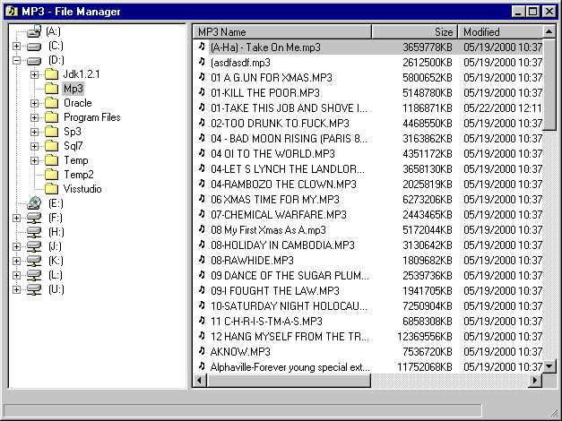



## MP3 Manager

### Description

MP3 Manager, manage all your mp3's with this program! Just click the drive or folder you wish to search. Searches whole drives or folders in seconds! Also you can edit ID3 tags including Genre, copy, move, rename mp3's, create - delete - rename folders. Just right click for little popup menus of what you can do. Also, just drag and drop mp3's just like in explorer to move or copy them and click the column headers to sort the list! For a more advanced version visit:

http://www.audiopimp.com
 
### More Info
 
None, although you need some mp3 someplace on your computer.

You need to understand APIs and manipulating files open for binary access.

             |
---                |---
**Submitted On**   |2000-05-24 15:16:24
**By**             |[John O'Donald](https://github.com/Planet-Source-Code/PSCIndex/blob/master/ByAuthor/john-o-donald.md)
**Level**          |Advanced
**User Rating**    |4.5 (18 globes from 4 users)
**Compatibility**  |VB 5\.0, VB 6\.0
**Category**       |[Complete Applications](https://github.com/Planet-Source-Code/PSCIndex/blob/master/ByCategory/complete-applications__1-27.md)
**World**          |[Visual Basic](https://github.com/Planet-Source-Code/PSCIndex/blob/master/ByWorld/visual-basic.md)
**Archive File**   |[CODE\_UPLOAD60695242000\.zip](https://github.com/Planet-Source-Code/john-o-donald-mp3-manager__1-8334/archive/master.zip)

### API Declarations

A few...

